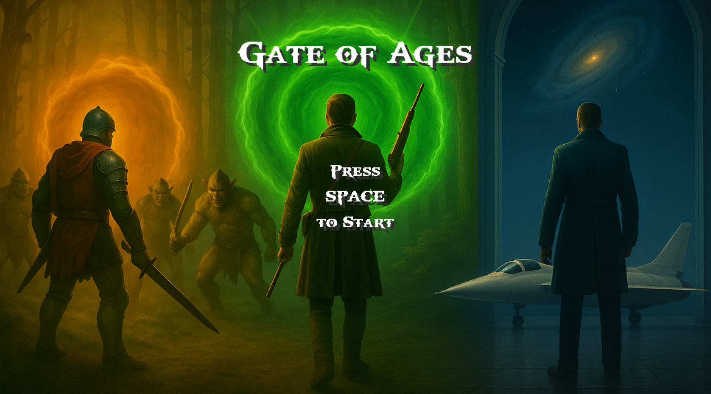
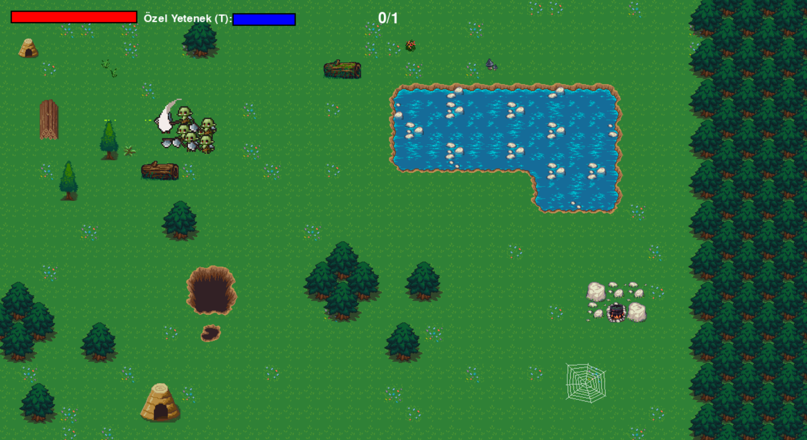
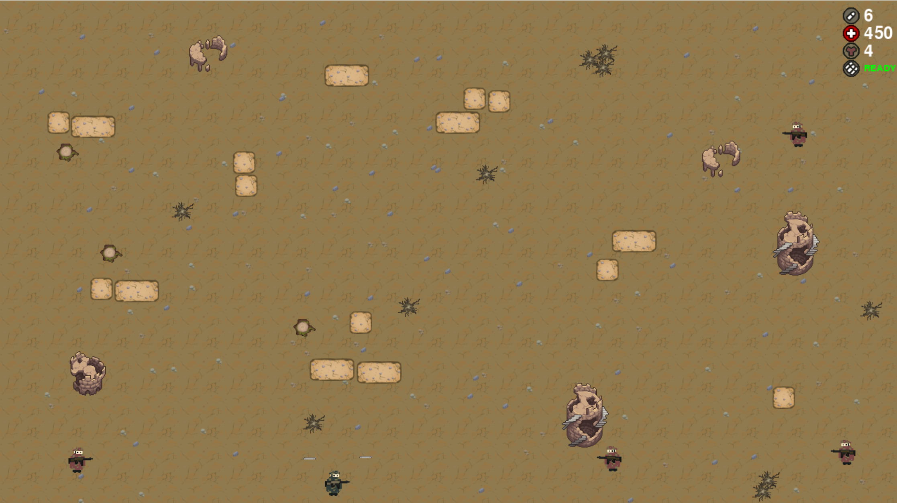
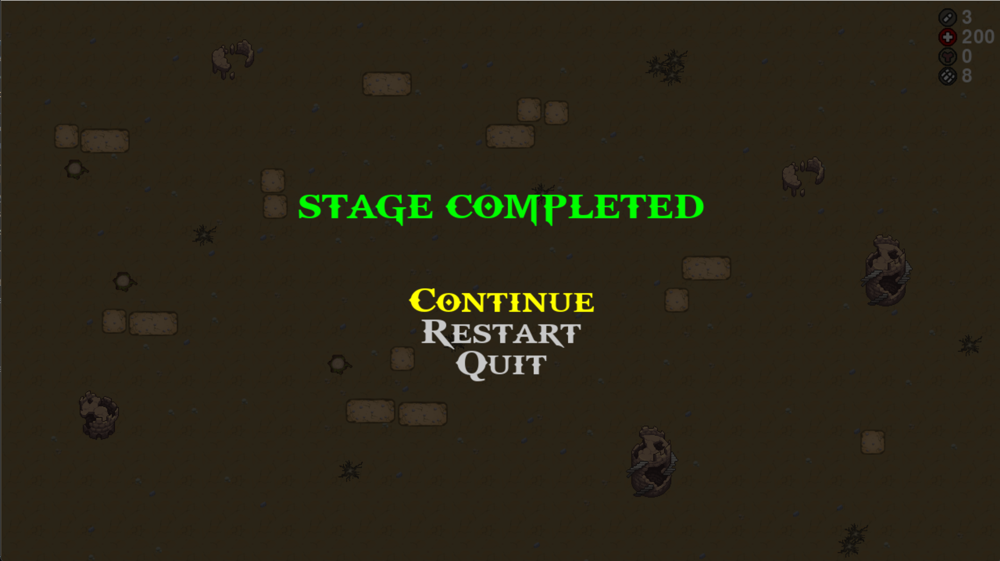
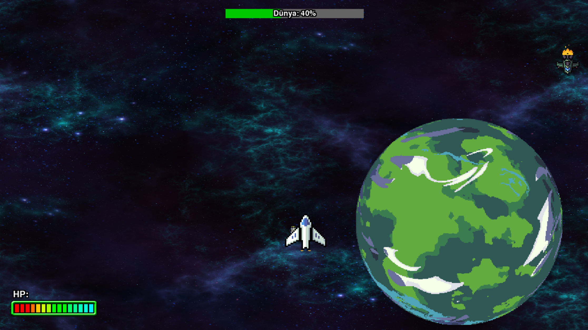
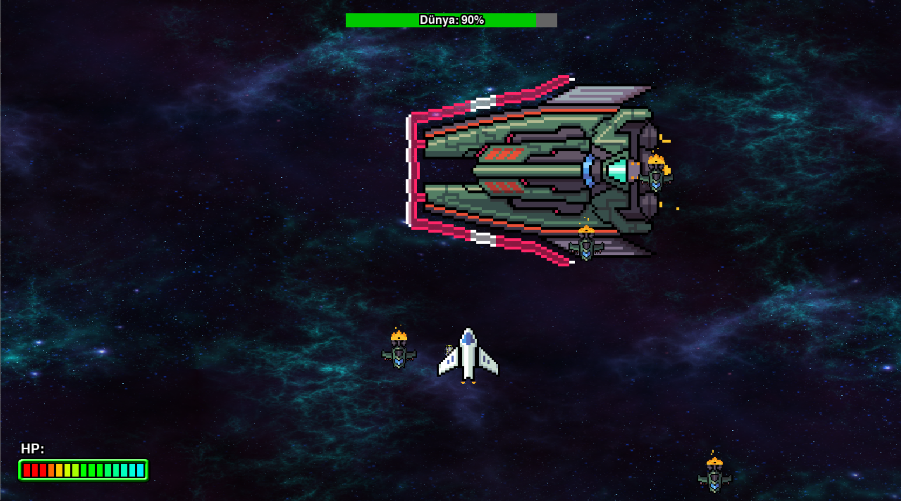
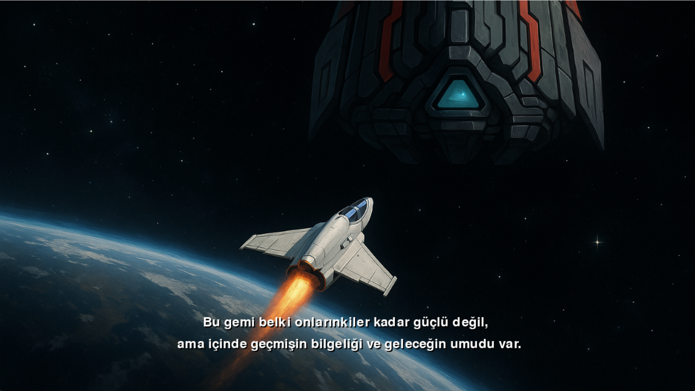

# Gate of Ages

## 🎮 Oyun Tanıtımı

**Gate of Ages**, zamanda sürgün edilen Aryn adlı pilotun, üç farklı çağda hayatta kalma mücadelesini anlatan hikaye tabanlı bir **platform / shooter** oyunudur. Oyuncu, geçmişin tehlikeli topraklarından geleceğin karanlık uzay istasyonlarına kadar farklı evrenlerde düşmanlarla mücadele eder, portalları aktive ederek sonraki aşamalara geçer.

## 📜 Hikaye Özeti

### 🚀 **Sürgün ve Düşüş**

> *"Galaksiler Arası Konsey’in en seçkin pilotuydu Aryn…  
> Ta ki bir sabotajla suçlu ilan edilip, zamanı bükerek sürgüne gönderilene dek."*

Galaksiler arası barışı koruyan Konsey’in en gözde pilotu Aryn, hiperçekirdek laboratuvarında gerçekleşen büyük bir patlamanın sorumlusu ilan edilir. Ancak Aryn gerçeği bilmektedir: Patlama, Konsey'in içindeki bir ihanetin eseridir. Olaydan sağ kurtulan Aryn, hiçlikte açılan bir zaman kapısından çekilerek bilinmeyen diyarlara sürgün edilir. Bu, sadece fiziksel değil, zamansal bir sürgündür.

---

### ⚔️ **Bölüm 1: Orklar Diyarı – Yitik Şövalye**

Aryn gözlerini açtığında kendisini kara büyü ve dev orklar tarafından yönetilen ilkel bir çağda bulur.  
Gelişmiş silahları çalışmaz hâle gelmiştir. Elinde sadece kırık dökük bir kılıç ve eski çağların savaş zırhı vardır.  
Karanlık ormanlar, taş kuleler ve gökyüzünü delen alevli ork kaleleri arasında hayatta kalmaya çalışır.
Efsanelerde anlatılan **Yitik Şövalye**'nin yoluna düşer. Zamanın ipuçlarını takip ederek orklar diyarındaki gizemli bir portala ulaşır.

---

### 🔫 **Bölüm 2: Modern Dünya – Sürgün Ajan**

Aryn, bir anda kendisini çürümüş şehirlerin ortasında bulur.  
Savaş burada çok daha acımasızdır. Her köşe başında ajanlar ve makineli tüfek sesleri yankılanmaktadır.  
Konsey'in gözetiminde olan bu şehirde, gerçek düşmanlarına bir adım daha yaklaşır.
Yıkık binaların arasında, dev kulelerinde gizlenen bir portalın sinyalini yakalar.  
Ancak bu sefer, peşindeki avcılar daha tehlikelidir.  
Artık sadece hayatta kalmak değil, gerçeği ortaya çıkarmak da bir görevdir.

---

### 🌌 **Bölüm 3: Uzayın Derinlikleri – Geri Dönüş**

Son portal onu evine, yıldızların derinliklerine getirir. Ancak her şey eskisi gibi değildir.  
Kronos Lejyonu adıyla bilinen karanlık bir güç, galaksinin kontrolünü ele geçirmiştir.  
Aryn’in sürgününe neden olan sabotajın arkasındaki asıl düşman şimdi **Oblivion Prime** adındaki dev savaş gemisinde saklanmaktadır.
Bu dev savaş gemisinin yolladığı düşman gemileri dünyayı yok etme niyetindedir.  
Kendi gemisini toparlar, son kez motorları ateşler ve yıldız filolarının arasından geçerek son savaşa doğru yola çıkar.

---

### 🏆 **Son Söz**

> *"Sürgünümün bitmesini beklemeyeceğim. Onlar beni susturamadı.  
> Şimdi sıra bende... Gerçeği tüm galaksiye haykırmaya geliyorum."*

Galaksiler arası zaman zincirini kıran Aryn, sonunda kendi adaletini sağlamak ve adını temize çıkarmak için son mücadeleye hazırlanır.


## 🕹️ Oynanış Özellikleri

- **Üç Farklı Evren:** Orta Çağ, Modern Dünya ve Uzay.
- **Silah ve Yakın Dövüş Mekanikleri:**  
  - Orklar diyarında kılıç.
  - Modern dünyada tüfek.
  - Uzayda lazer silahları ve gemi kontrolü.
- **Portal Geçişleri:**  
  Her seviyenin sonunda bir portal aktive edilerek sonraki çağ başlatılır.
- **Sağlık ve Mühimmat Yönetimi.**

## 📷 Görseller

### Oyun Açılışı


### Orklar Diyarı


### Sürgün Ajan




### Uzayın Derinlikleri





   

## 🚀 Kurulum ve Çalıştırma

1. **Gereksinimler:**
   - Python 3.11+
   - Pygame 2.6+

2. **Kurulum:**
   ```bash
   pip install pygame
